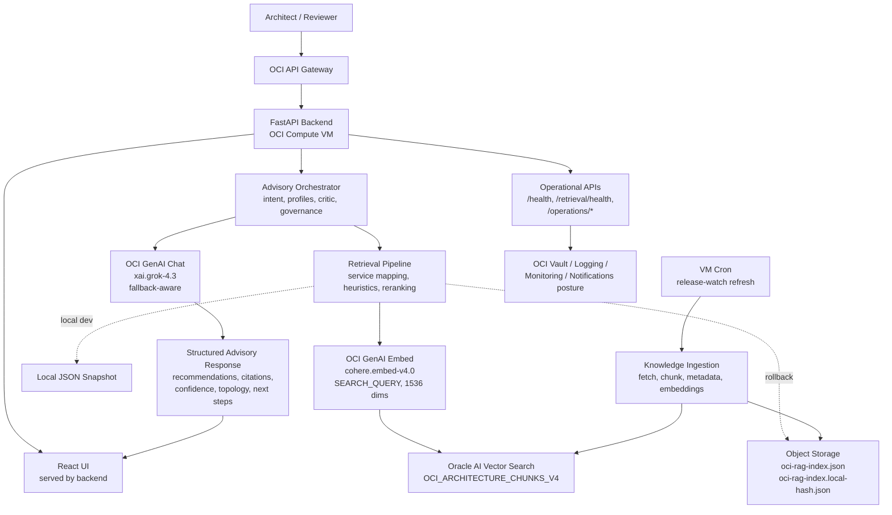

# OCI Architecture Studio

OCI Architecture Studio is an AI-powered architecture advisory platform for Oracle Cloud Infrastructure. It helps reviewers turn OCI, migration, resilience, security, observability, and cost questions into grounded recommendations with citations, confidence signals, and rollback-safe operational controls.

Current version: `1.0.3`

## Current State

- **Staging synthesis:** OCI Generative AI chat is active through `ADVISORY_SYNTHESIS_PROVIDER=oci_genai`.
- **Chat model:** `xai.grok-4.3`.
- **Retrieval provider:** Oracle AI Vector Search.
- **Embedding provider:** OCI Generative AI embeddings with `cohere.embed-v4.0`.
- **Vector dimensions:** `1536`.
- **Active vector table:** `OCI_ARCHITECTURE_CHUNKS_V4`.
- **Active corpus:** `60` curated OCI architecture chunks across `52` services and `15` service domains.
- **Rollback:** previous 256-dimension local-hash Oracle table and Object Storage manifest are retained.
- **Validation:** live retrieval regression `32/32`, golden evals `18/18`, edge evals `8/8`.

## Architecture



## Request Flow

1. The user submits an architecture question from the React UI or API.
2. The backend classifies intent, maps known source services such as AWS EKS/RDS to OCI targets, and selects an advisory profile.
3. Retrieval embeds the expanded query with OCI GenAI, searches Oracle AI Vector Search, reranks candidates, and protects intent-critical services such as Logging, Monitoring, Object Storage, Load Balancer, and Database Services.
4. The controlled in-process orchestration layer shares the same evidence across specialist roles and runs a validation critic for grounding, citations, freshness, and unsupported service claims.
5. OCI GenAI synthesis produces the final structured response using the retrieved evidence and grounding prompt.
6. The API returns recommendations, risks, assumptions, citations, decision reasoning, confidence, topology metadata, governance metadata, release context, and optional debug traces.

## Repository Layout

```text
app/backend/       FastAPI API, retrieval, synthesis, orchestration, operations
app/frontend/      React + Vite user interface
docs/              Product, architecture, current status, runbooks, reports
evals/             Golden, edge, retrieval, and quality eval datasets
infra/             Deployment scripts, runtime profiles, Terraform assets
knowledge/         Source registries, ingestion, refresh policy, snapshots
prompts/           Versioned advisory prompt templates
tests/             Integration and regression test scaffolding
```

## Core Capabilities

- OCI architecture, migration, DR, cost, observability, security, AI/ML, analytics, SaaS, and release-aware advisory intents.
- Retrieval-grounded recommendations with OCI source citations and section-level traceability.
- OCI GenAI synthesis with deterministic fallback design.
- OCI GenAI semantic embeddings on Oracle AI Vector Search.
- Rollback-safe Object Storage and local JSON retrieval paths.
- Controlled in-process specialist orchestration with one final synthesis step.
- Advisory quality checks for hallucinations, unsupported OCI claims, stale guidance, citation coverage, and confidence.
- Saved review history with redaction, retention, export, and delete controls.
- Knowledge refresh pipeline with candidate snapshots, eval gates, promotion, and rollback.
- Operational diagnostics for retrieval, synthesis, release freshness, runtime readiness, OCI posture, and lightweight analytics.

## Run Locally

Create a backend environment:

```bash
cd app/backend
python3.12 -m venv .venv
source .venv/bin/activate
pip install -r requirements.txt
cp ../../.env.example .env
PYTHONPATH=src uvicorn oci_arch_studio_backend.main:app --reload --port 8000
```

Create or refresh the local knowledge index:

```bash
python3 knowledge/ingestion/ingest.py --no-fetch
```

Run the frontend:

```bash
cd app/frontend
npm install
npm run dev
```

## Useful Checks

Backend focused tests:

```bash
PYTHONPATH=app/backend/src app/backend/.venv/bin/python -m pytest \
  app/backend/tests/test_advisory_quality.py \
  app/backend/tests/test_retrieval.py \
  app/backend/tests/test_oracle_vector_store.py \
  app/backend/tests/test_embeddings.py
```

Retrieval health:

```bash
curl http://localhost:8000/retrieval/health
```

Golden evals:

```bash
PYTHONPATH=app/backend/src app/backend/.venv/bin/python evals/run_golden.py \
  --cases evals/golden-prompts.jsonl \
  --output-dir evals/reports/local-golden
```

## Staging Rollback Summary

Embedding rollback is config-only through the reviewed runtime path:

```text
EMBEDDING_PROVIDER=local
OCI_VECTOR_OBJECT_NAME=oci-rag-index.local-hash.json
OCI_VECTOR_TABLE_NAME=OCI_ARCHITECTURE_CHUNKS
OCI_VECTOR_INDEX_NAME=OCI_ARCH_CHUNKS_VEC_IDX
OCI_VECTOR_DIMENSIONS=256
```

After rollback, restart the backend and confirm `/retrieval/health` reports `embedding_provider=local`, `index_dimensions=256`, and `embedding_index_guardrail.ok=true`.

## Documentation

Start with [docs/README.md](docs/README.md), then use:

- [Current status](docs/current/status.md)
- [Architecture diagrams](docs/architecture/architecture-diagrams.md)
- [OCI-native retrieval runbook](docs/runbooks/oci-native-retrieval-runbook.md)
- [Embedding migration report](evals/reports/embedding-migration/report.md)
