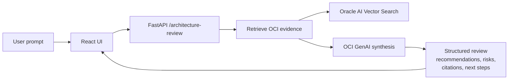

# OCI Architecture Studio

OCI Architecture Studio is an AI-powered OCI architecture review assistant. It turns architecture, migration, resilience, security, observability, AI/ML, analytics, SaaS, and cost questions into structured recommendations with citations and rollback-safe operations.

Current version: `1.0.4`

## Current Staging Runtime

| Area | Value |
| --- | --- |
| Synthesis | OCI GenAI, `ADVISORY_SYNTHESIS_PROVIDER=oci_genai` |
| Chat model | `xai.grok-4.3` |
| Retrieval | Oracle AI Vector Search |
| Embeddings | OCI GenAI `cohere.embed-v4.0` |
| Dimensions | `1536` |
| Vector table | `OCI_ARCHITECTURE_CHUNKS_V4` |
| Corpus | 60 curated OCI chunks |

Local development uses deterministic synthesis, local JSON retrieval, and local hash embeddings so it can run without OCI credentials.

## How It Works



Request flow:

1. User submits a prompt.
2. Backend classifies intent and maps services when needed.
3. Retrieval finds relevant OCI evidence.
4. OCI GenAI synthesizes a structured answer.
5. Validation logic checks citations, unsupported claims, fallback, and quality.
6. Frontend displays the review in organized sections.

## Runtime Switches

| Concern | Local/default | Staging/current | Rollback |
| --- | --- | --- | --- |
| Synthesis | `deterministic` | `oci_genai` | `deterministic` |
| Retrieval | `local_json` | `oracle_ai_vector_search` | `oci_object_storage`, then `local_json` |
| Embeddings | `local` | `oci_genai` | `local` |

The API response exposes `synthesis_provider` and `synthesis_fallback_used`. `/retrieval/health` exposes retrieval provider, embedding provider, dimensions, and guardrail status.

## Repository Layout

```text
app/backend/       FastAPI API, retrieval, synthesis, orchestration, operations
app/frontend/      React + Vite user interface
docs/              Current status, product docs, architecture, runbooks, reports
evals/             Golden, edge, retrieval, and quality evals
infra/             Deployment scripts, runtime profiles, Terraform
knowledge/         Ingestion, source registry, release refresh, snapshots
prompts/           Prompt templates
tests/             Test scaffolding
```

## Run Locally

Backend:

```bash
cd app/backend
python3.12 -m venv .venv
source .venv/bin/activate
pip install -r requirements.txt
PYTHONPATH=src uvicorn oci_arch_studio_backend.main:app --reload --port 8000
```

Knowledge index:

```bash
python3 knowledge/ingestion/ingest.py --no-fetch
```

Frontend:

```bash
cd app/frontend
npm install
npm run dev
```

## Useful Checks

```bash
curl http://localhost:8000/health
curl http://localhost:8000/retrieval/health

PYTHONPATH=app/backend/src app/backend/.venv/bin/python evals/run_golden.py \
  --cases evals/golden-prompts.jsonl \
  --output-dir evals/reports/local-golden
```

## Start Reading

- [Current status](docs/current/status.md)
- [Demo readiness](docs/current/demo-readiness.md)
- [Architecture diagrams](docs/architecture/architecture-diagrams.md)
- [Operational runbook](docs/runbooks/operational-runbook.md)
- [Retrieval runbook](docs/runbooks/oci-native-retrieval-runbook.md)
