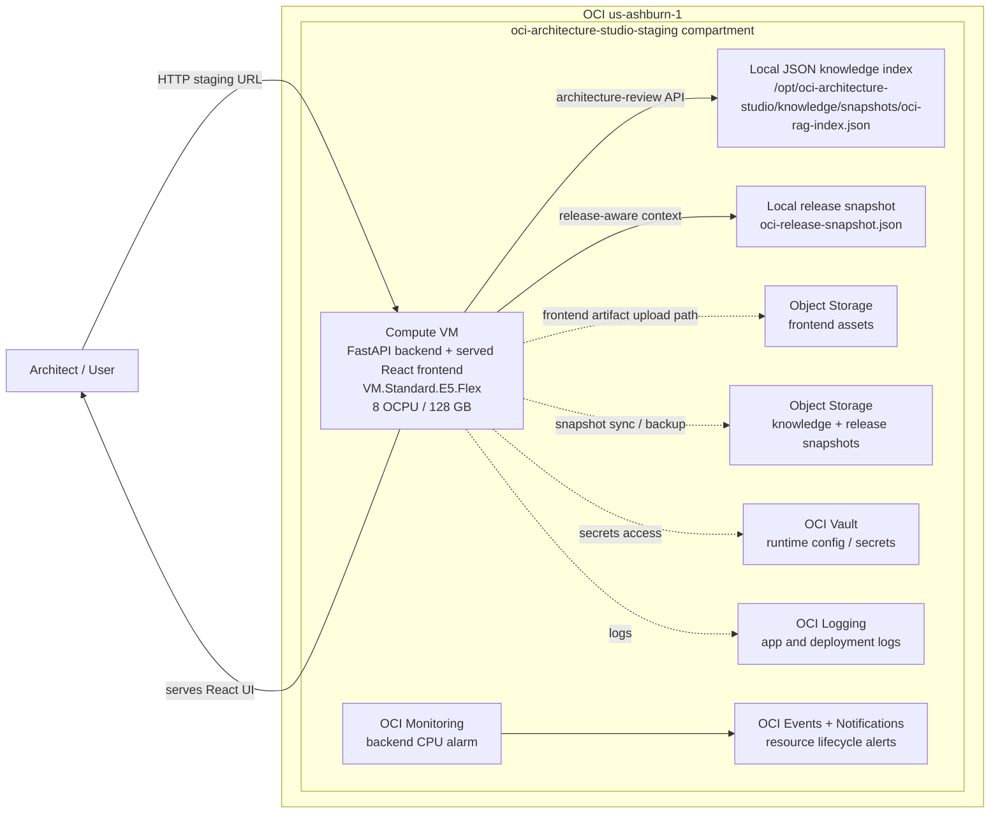
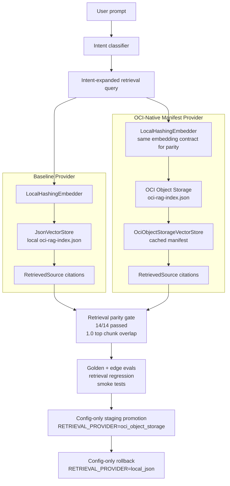
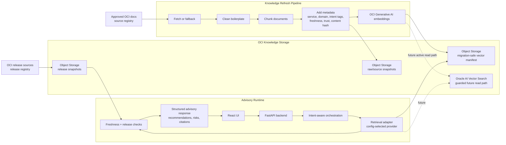
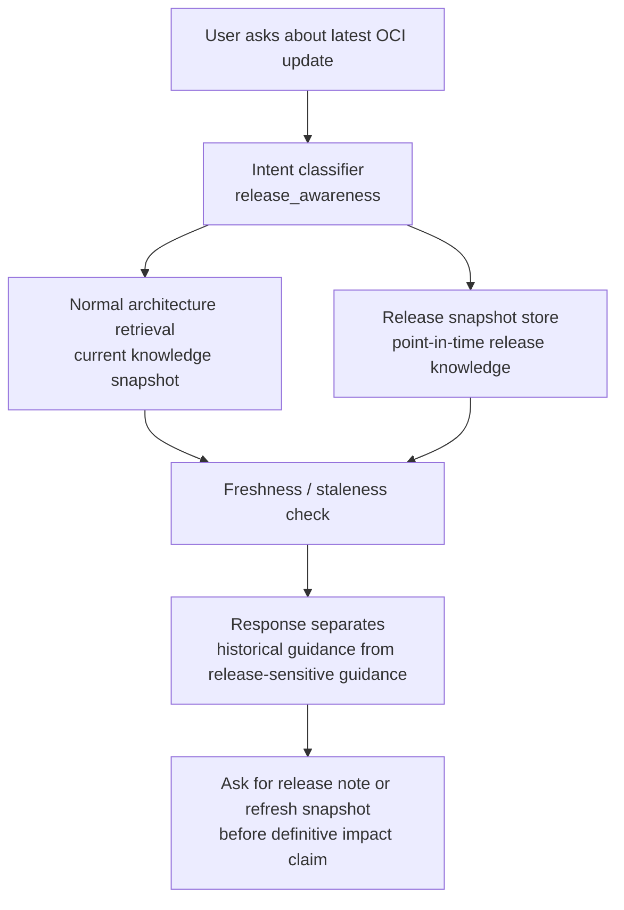
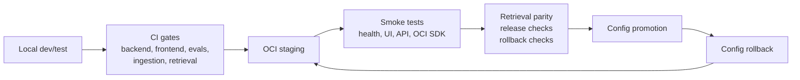

# OCI Architecture Studio — Architecture Diagrams

Date: 2026-05-15

These diagrams summarize the current working platform, the validated retrieval migration path, and the next Oracle AI Vector Search target state.

## 1. Current Working Staging Architecture

Current staging is intentionally simple: one codebase, one backend VM, backend-served frontend, local JSON retrieval on the VM, and OCI services for deployment support, snapshots, secrets, logging, monitoring, and notifications.



Current active retrieval provider:

```text
RETRIEVAL_PROVIDER=local_json
```

## 2. Validated Dual-Provider Retrieval Migration Path

The OCI Object Storage retrieval provider has passed parity against the stable local provider. Promotion is config-only and rollback is also config-only.



Validated parity result:

- `local_json`: passed
- `oci_object_storage`: passed
- parity cases: `14/14`
- golden evals: `6/6` for both provider paths
- edge-case evals: `8/8` for both provider paths
- retrieval regression: `14/14` for both provider paths

## 3. Target OCI-Native Retrieval Architecture

This is the next production retrieval target. Oracle AI Vector Search remains guarded until schema, indexing, query behavior, and parity are validated.



Promotion sequence:

1. Keep `local_json` as rollback provider.
2. Promote `oci_object_storage` as active staging provider after parity.
3. Validate staging smoke and evals.
4. Implement Oracle AI Vector Search table/index.
5. Dual-run Vector Search against `oci_object_storage`.
6. Promote Oracle AI Vector Search only after parity and rollback validation.

## 4. Release-Awareness Flow

Release-awareness is a differentiator because release context is stored separately from normal architecture knowledge. The system can avoid treating old architecture guidance as current release truth.



Current release-awareness maturity:

- point-in-time release snapshot exists
- release-aware intent exists
- stale-source caution exists
- full continuous release watcher and impact analyzer are still future work

## 5. Operational Control Points



Core operating rule:

```text
ONE codebase / MULTIPLE environments
Local = development and testing
OCI = staging, demo, production
Provider changes happen through config, not code forks.
```
