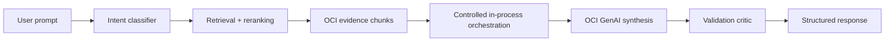

# Advisory Intelligence

## Purpose

The advisory layer turns a user prompt plus retrieved OCI evidence into a structured architecture review.

## Current Flow



## What The Backend Adds

- intent classification
- source-service mapping such as AWS to OCI
- retrieval terms and service priorities
- evidence chunk selection
- recommendation confidence
- risks and assumptions
- section-level citations
- topology metadata
- governance metadata
- migration and FinOps metadata
- release context from snapshots

## Synthesis Provider

Staging uses:

```text
ADVISORY_SYNTHESIS_PROVIDER=oci_genai
```

Rollback/local mode:

```text
ADVISORY_SYNTHESIS_PROVIDER=deterministic
```

If OCI GenAI fails or returns invalid JSON, the service fails closed to deterministic synthesis and records fallback metadata.

## Orchestration

The current orchestration is controlled and in-process. It has bounded specialist roles and one final synthesis step.

It is not:

- autonomous agent execution
- LangGraph
- persistent memory
- a distributed workflow engine

## Quality Checks

The validation layer checks for:

- missing citations
- unsupported OCI service claims
- low evidence coverage
- stale release claims
- inconsistent recommendations
- fallback usage

These checks are regression guardrails, not a replacement for architect review.

## Current Limits

- The corpus is curated and small.
- Quality scores are heuristic.
- Release awareness is snapshot-based.
- Governance and FinOps metadata are advisory only.
