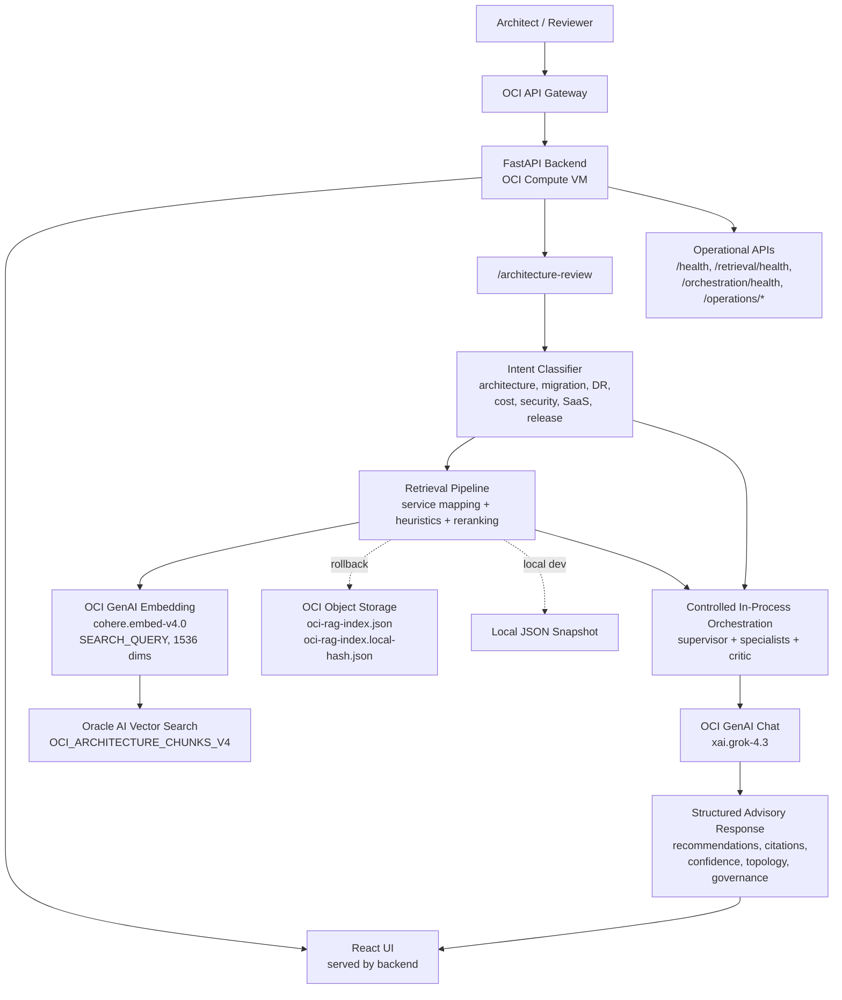
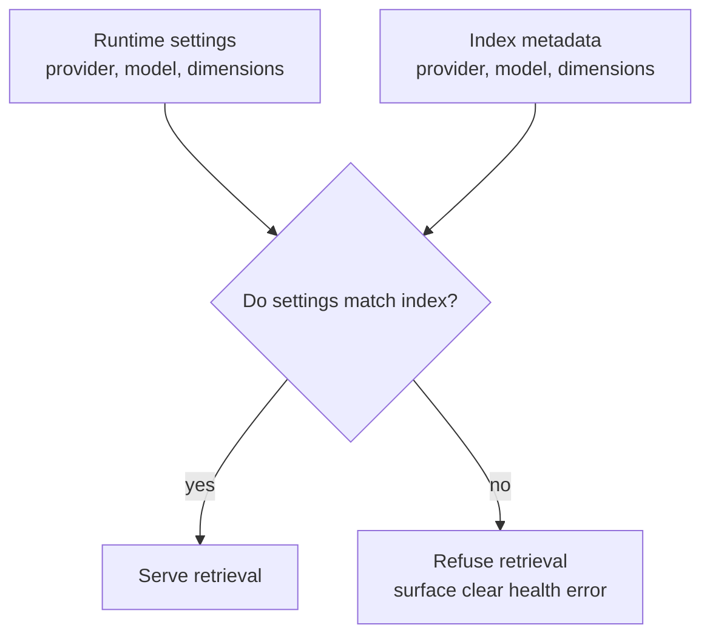
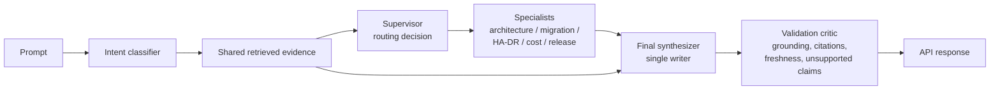
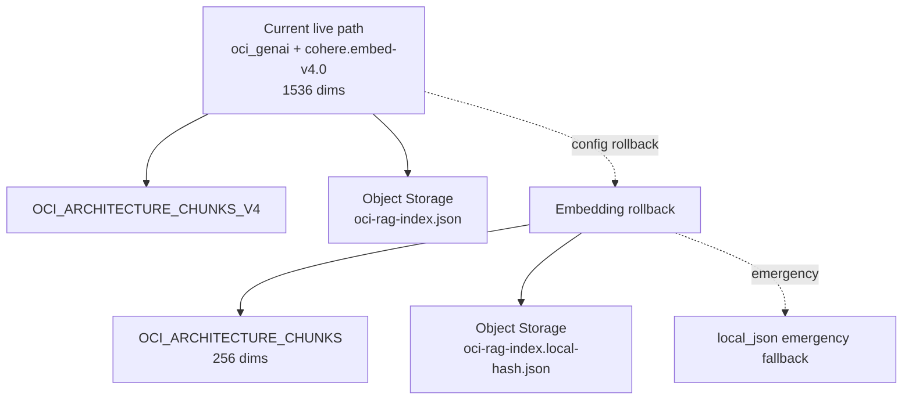
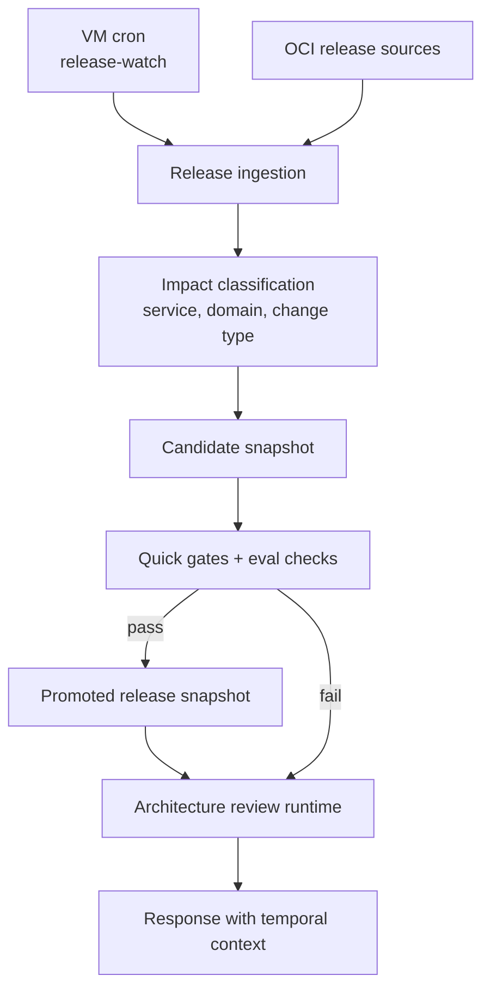

# Architecture Diagrams

Date: 2026-05-16

These diagrams reflect the current code and staging runtime after OCI GenAI synthesis and OCI GenAI embedding promotion.

## 1. Runtime Architecture



## 2. Knowledge And Embedding Pipeline

```mermaid
flowchart LR
  Registry["knowledge/source_registry.json\napproved OCI sources"]
  Fetch["Fetch or registry fallback"]
  Chunk["Clean + chunk documents"]
  Metadata["Enrich metadata\nservice, domain, category,\nintent tags, migration mappings,\nfreshness, trust"]
  EmbedDocs["OCI GenAI Embedding\ncohere.embed-v4.0\nSEARCH_DOCUMENT, 1536 dims"]
  Manifest["Vector manifest\noci-rag-index.json"]
  ObjectStorage["Object Storage\nactive + rollback manifests"]
  OracleVector["Oracle AI Vector Search\nOCI_ARCHITECTURE_CHUNKS_V4"]
  Gates["Validation gates\nhealth, regression, golden, edge"]
  Promote["Runtime promotion\nVault/runtime env path"]

  Registry --> Fetch --> Chunk --> Metadata --> EmbedDocs --> Manifest
  Manifest --> Gates
  Gates --> ObjectStorage
  Gates --> OracleVector
  ObjectStorage --> Promote
  OracleVector --> Promote
```



Current promoted embedding metadata:

```text
embedding_provider=oci_genai
embedding_model=cohere.embed-v4.0
dimensions=1536
chunk_count=60
```

## 3. Retrieval Guardrail



The guardrail prevents silent mismatches such as sending `cohere.embed-v4.0` query vectors to a 256-dimension local-hash index.

## 4. Advisory Orchestration



This is controlled in-process orchestration. It is not autonomous multi-agent execution, does not use long-running memory, and does not let specialists mutate citations independently.

## 5. Rollback Architecture



Rollback is intentionally config-only through the reviewed runtime path, followed by backend restart and `/retrieval/health` verification.

## 6. Release-Aware Refresh



Release refresh never runs during a user query. User queries consume the last promoted release snapshot and freshness metadata.
