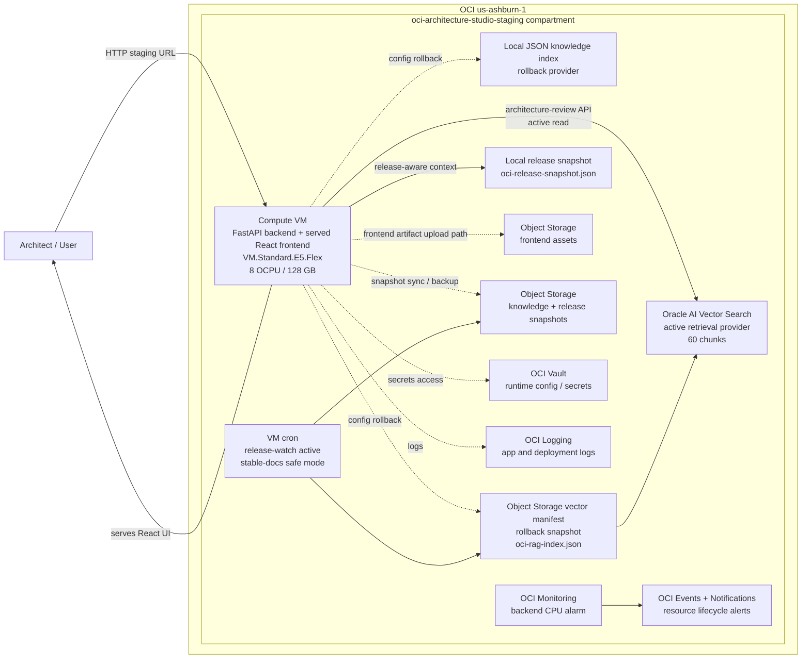
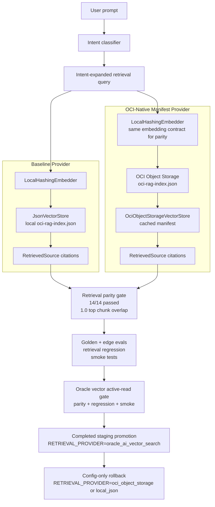
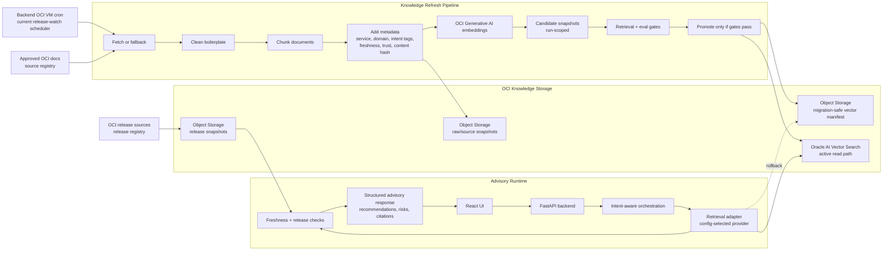
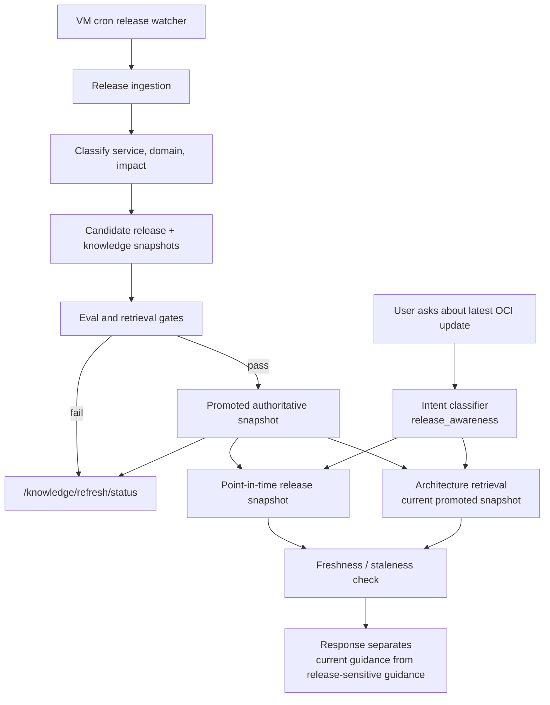
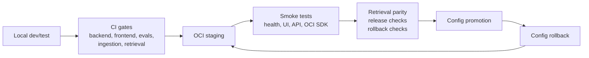

# OCI Architecture Studio — Architecture Diagrams

Date: 2026-05-16

These diagrams summarize the current working platform, the completed Oracle AI Vector Search active-read promotion, the Object Storage rollback path, release-awareness, and operational control points.

## 1. Current Working Staging Architecture

Current staging is intentionally simple: one codebase, one backend VM, backend-served frontend, Oracle AI Vector Search active retrieval, Object Storage rollback snapshots, and OCI services for deployment support, snapshots, secrets, logging, monitoring, and notifications.



Current active retrieval provider:

```text
RETRIEVAL_PROVIDER=oracle_ai_vector_search
```

## 2. Validated Retrieval Promotion Path

OCI Object Storage first passed parity against the stable local provider, then Oracle AI Vector Search passed active-read parity and was promoted in staging. Rollback to Object Storage and local JSON remains config-only.



Validated parity result:

- `local_json`: passed
- `oci_object_storage`: passed
- `oracle_ai_vector_search`: passed active-read promotion gates
- parity cases: `14/14`
- golden evals: `6/6` for both provider paths
- edge-case evals: `8/8` for both provider paths
- retrieval regression: `14/14` for both provider paths
- staging active provider: `oracle_ai_vector_search`
- rollback providers: `oci_object_storage`, then `local_json`

## 3. Current OCI-Native Retrieval Architecture

Oracle AI Vector Search is the active staging read path. Object Storage remains the promoted manifest store and immediate rollback provider.



Migration sequence:

1. Keep `local_json` as rollback provider.
2. Promote `oci_object_storage` as active staging provider after parity. — Done
3. Validate staging smoke and evals. — Done
4. Implement Oracle AI Vector Search table/index. — Done
5. Dual-run Vector Search against `oci_object_storage`. — Done
6. Promote Oracle AI Vector Search after parity and rollback validation. — Done

## 4. Continuous Release-Awareness Flow

Release-awareness is a differentiator because release context is stored separately from normal architecture knowledge. The system can avoid treating old architecture guidance as current release truth.



Current release-awareness maturity:

- point-in-time release snapshot exists
- scheduled release watcher runs from backend OCI VM cron
- candidate-first refresh and eval-gated promotion exist
- release-aware intent exists
- stale-source caution exists
- deeper semantic impact analysis remains future work

## 5. Operational Control Points



Core operating rule:

```text
ONE codebase / MULTIPLE environments
Local = development and testing
OCI = staging, demo, production
Provider changes happen through config, not code forks.
```

## 6. Controlled Multi-Agent Advisory Orchestration

The current agent foundation is controlled and in-process. It adds bounded specialist collaboration and critic visibility while preserving the same retrieval, synthesis, and eval paths.

```mermaid
flowchart LR
  Prompt["User prompt"]
  Classifier["Intent classifier"]
  Evidence["Shared retrieval evidence"]
  Supervisor["Supervisor\nrouting decision"]
  Specialists["Selected specialists\narchitecture / migration / HA-DR / cost / release"]
  Aggregator["Final synthesizer\nsingle-writer response"]
  Synth["Configured synthesis provider\ndeterministic or OCI GenAI"]
  Quality["Citation + confidence analyzer"]
  Critic["Validation critic\ngrounding, citations, freshness,\nunsupported claims"]
  Response["Structured response\nactive agents, critic findings,\nconfidence, citations"]

  Prompt --> Classifier --> Evidence --> Supervisor --> Specialists --> Aggregator --> Synth --> Quality --> Critic --> Response
```



Rollback remains config-only:

```text
ADVISORY_ORCHESTRATION_MODE=supervised
ADVISORY_ORCHESTRATION_MODE=single_pass
```

Deferred by design:

- autonomous agent swarms
- distributed orchestration frameworks
- agent-specific memory
- provider-specific agent code paths
