# Controlled Multi-Agent Pilot

Last updated: 2026-05-15

## Goal

The controlled multi-agent pilot adds bounded specialist collaboration on top of the existing supervised orchestration foundation while preserving the stable advisory workflow.

This is not an autonomous agent swarm. It is an in-process, deterministic orchestration mode with centralized control, shared evidence, one final synthesis step, and config-only rollback.

## Workflow

```mermaid
flowchart LR
  Prompt["User prompt"]
  Intent["Intent classifier"]
  Evidence["Shared retrieval evidence"]
  Supervisor["Supervisor"]
  Specialists["Selected specialists"]
  Aggregator["Final synthesis step"]
  Quality["Citation + confidence checks"]
  Critic["Validation critic"]
  Response["Structured response"]

  Prompt --> Intent --> Evidence --> Supervisor --> Specialists --> Aggregator --> Quality --> Critic --> Response
```



## Centralized Control

These remain single-writer and centralized:

- intent classification
- retrieval provider selection
- evidence set construction
- citation linking
- confidence scoring
- final response synthesis
- quality metrics
- rollback configuration

Specialists cannot mutate citations, confidence, retrieval provider state, or final response fields.

## Specialist Agents

| Agent | Focus |
|---|---|
| `architecture_advisor` | OCI service placement, tier boundaries, assumptions, risks, and grounded design. |
| `migration_advisor` | Source-to-target mapping, migration waves, dependencies, validation, cutover, and rollback. |
| `ha_dr_advisor` | RTO/RPO, cross-region resilience, failover, database protection, audit, and runbooks. |
| `cost_advisor` | Rightsizing, autoscaling, storage choices, budgets, tagging, and cost-performance tradeoffs. |
| `release_awareness_advisor` | Freshness boundaries, release evidence, stale-guidance risk, and current-vs-snapshot caution. |
| `validation_critic` | Evidence support, citation coverage, freshness, unsupported-claim risk, and fallback behavior. |

## Routing Policy

`ADVISORY_ORCHESTRATION_MODE=multi_agent_pilot` enables deterministic routing.

The supervisor always selects a primary specialist from the classified intent. It may add supporting specialists when prompt terms or retrieved evidence indicate migration, HA/DR, cost, or release-awareness concerns.

Examples:

- migration prompt with cost terms: `migration_advisor` plus `cost_advisor`
- DR prompt: `ha_dr_advisor` plus `architecture_advisor`
- release prompt: `release_awareness_advisor` plus `architecture_advisor`

The pilot caps specialist selection to keep latency and response complexity bounded.

## Provider Abstraction

Agents do not directly call model providers. Final synthesis stays behind the existing config-driven provider boundary:

```bash
ADVISORY_SYNTHESIS_PROVIDER=deterministic
ADVISORY_SYNTHESIS_PROVIDER=oci_genai
```

Future provider adapters can follow the same contract without creating code forks.

## API Metadata

`POST /architecture-review` includes:

- `orchestration_mode`
- `active_agents`
- `routing_decision`
- `agent_trace`
- `agent_contributions`
- `aggregation_decision`
- `critic_findings`
- `orchestration_warnings`

`GET /orchestration/health` includes:

- latest orchestration mode
- active agents
- routing decision
- aggregation decision
- active agent count
- critic warning count
- request count

## Rollback

Rollback is config-only:

```bash
ADVISORY_ORCHESTRATION_MODE=supervised
```

or:

```bash
ADVISORY_ORCHESTRATION_MODE=single_pass
```

No prompt changes, code forks, or retrieval changes are required.

## Evaluation

The orchestration suite validates:

- expected orchestration mode
- required active agents
- minimum specialist contribution count
- aggregation decision presence
- critic findings
- grounding and citation quality
- hallucination-risk patterns

Run:

```bash
app/backend/.venv/bin/python evals/run_golden.py --cases evals/orchestration-quality.jsonl --output-dir evals/reports/orchestration-quality
```

## Next Milestone

Add critic policy-gate behavior for:

- unsupported service claims
- stale release assertions
- low-confidence production recommendations
- specialist disagreement
- missing specialist coverage for multi-domain prompts
