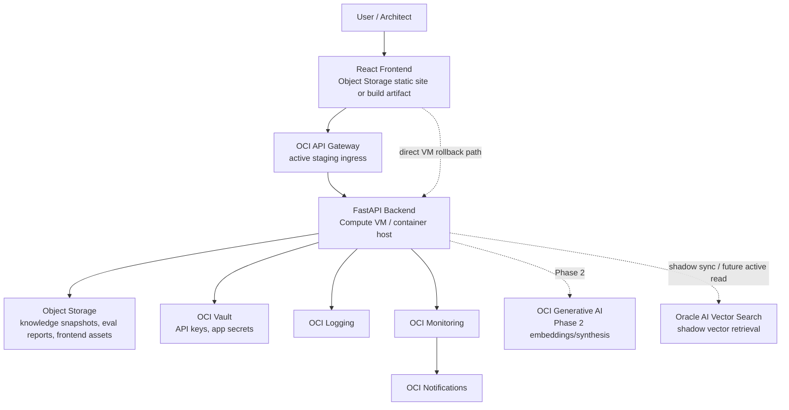

# OCI Architecture Studio — OCI Deployment Architecture

Last updated: 2026-05-15

## Goal

Document the current OCI staging deployment and the incremental path to an OCI-native, enterprise-ready RAG advisory system.

The guiding principle is:

```text
Preserve the validated flow first, then replace local development pieces with OCI-native services incrementally.
```

Avoid premature microservices, Kubernetes, and complex orchestration until traffic, tenant needs, and operational requirements justify them.

## Current Staging Deployment



## OCI Service Mapping

| Platform Need | Recommended OCI Service | Why |
|---|---|---|
| Backend API hosting | OCI Compute VM first; OKE later when operational need justifies it | Lowest migration risk. The current FastAPI app runs as-is with `uvicorn`; OKE is a supported profile/scaffold, not the active staging runtime. |
| API exposure | OCI API Gateway active in staging; direct backend VM retained as rollback | Keeps a managed OCI ingress path while preserving a simple rollback endpoint during beta. |
| Frontend hosting | Object Storage static website or static assets behind CDN later | React build is static and can be uploaded with little operational overhead. |
| Knowledge snapshots | Object Storage | Durable, low-cost storage for generated JSON indexes, eval reports, release snapshots, and raw source archives. |
| Secrets | OCI Vault | Central place for API keys, database credentials, signing keys, and future model/provider credentials. |
| Embeddings | OCI Generative AI | OCI-native embedding provider path for production semantic retrieval. |
| Vector search | Oracle AI Vector Search | Oracle AI Vector Search is the OCI-native enterprise path when metadata, audit, and vectors should live close together. Current staging has Autonomous Database, table/index, and shadow sync validated; active reads still use Object Storage snapshots until promotion gates pass. |
| Logging | OCI Logging | Centralized app, ingestion, and release job logs. |
| Monitoring | OCI Monitoring | Metrics, alarms, health checks, ingestion failures, retrieval miss rate, eval pass/fail trend. |
| Notifications | OCI Notifications | Alert routing for failed ingestion, failing evals, stale knowledge, and production health alarms. |
| Networking | VCN, public/private subnets, security lists or NSGs | Keeps backend controlled while allowing frontend/API access. |
| IAM/security | OCI IAM compartments, dynamic groups, policies | Least-privilege service access to Object Storage, Vault, Logging, Monitoring, and future vector/GenAI services. |

## Phased Migration Strategy

### Phase 1 — Deploy Current MVP With Minimal Changes

Goal:
- run the validated app in OCI without changing the application architecture.

Steps:
1. Create a project compartment.
2. Create VCN, public subnet, internet gateway, route table, and security list.
3. Run FastAPI backend on a small Compute VM.
4. Build React frontend and upload static assets to Object Storage or serve via the backend initially.
5. Store generated knowledge and release snapshots in Object Storage.
6. Store app secrets in Vault.
7. Send logs to OCI Logging.
8. Add Monitoring alarms and Notifications for API availability and instance health.

This phase is complete in staging. The active staging retrieval provider is `oci_object_storage` backed by the Object Storage snapshot; `local_json` remains the deterministic rollback provider.

### Phase 2 — Replace Local Embeddings/Vector Index

Goal:
- move from local hash embeddings and JSON vectors to OCI-native semantic retrieval.

Steps:
1. Keep embedding and vector provider abstractions behind configuration.
2. Use OCI Generative AI embedding provider where configured, with local deterministic fallback.
3. Use Oracle AI Vector Search where configured, with Object Storage/local JSON fallback.
4. Persist chunk metadata, embeddings, source version, freshness, and trust level.
5. Keep JSON vector store as local fallback.
6. Continue retrieval-quality evals before promoting providers.

### Phase 3 — Productionize Ingestion And Release Intelligence

Goal:
- make knowledge refresh and release awareness operational.

Steps:
1. Keep release-watch refresh on the backend OCI Compute VM cron path.
2. Archive raw fetched docs and parsed snapshots in Object Storage.
3. Add content hashing and selective reindexing.
4. Add release impact classifier.
5. Mark affected chunks as `needs_release_review`.
6. Rerun impacted eval suites automatically.
7. Notify owners when recommendations may be stale.

## Terraform Structure

```text
infra/
  terraform/
    backend.object-storage.example.tf
    README.md
    shared.auto.tfvars.example
    envs/
      dev/
        ...
      test/
        providers.tf
        variables.tf
        terraform.tfvars.example
        main.tf
        outputs.tf
        cloud-init.yaml.tftpl
    modules/
      foundation/
        main.tf
        variables.tf
        outputs.tf
```

The companion deployment runbook is `docs/runbooks/oci-landing-zone-runbook.md`.

## Configuration Strategy

Environment-specific settings should live in `terraform.tfvars` and deployment-time environment variables.

Application configuration:

```text
APP_ENV
LOG_LEVEL
BACKEND_CORS_ORIGINS
KNOWLEDGE_INDEX_PATH
RELEASE_SNAPSHOT_PATH
OCI_REGION
OCI_PROFILE
DEPLOYMENT_PROFILE
RETRIEVAL_PROVIDER
ADVISORY_SYNTHESIS_PROVIDER
VECTOR_DB_URL
```

Secrets should not be committed. Use OCI Vault for:

- model provider API keys if needed
- database/vector store credentials
- future auth client secrets
- signing/encryption secrets

## OCI-Native RAG Evolution

### Current

```text
source registry -> local ingestion -> local hash embeddings -> Object Storage active snapshot -> FastAPI retrieval
```

### Phase 2

```text
source registry
  -> ingestion cleanup
  -> chunk metadata/versioning
  -> OCI Generative AI embeddings
  -> Oracle AI Vector Search shadow index
  -> metadata-filtered retrieval
  -> citation-aware synthesis
```

### Metadata Indexing

Index these fields with each vector:

- `chunk_id`
- `source_id`
- `source_url`
- `service`
- `service_domain`
- `intent_tags`
- `architecture_patterns`
- `trust_level`
- `source_version`
- `content_hash`
- `fetched_timestamp`
- `freshness_score`
- `valid_from`
- `valid_to`
- `release_review_status`

### Chunk Freshness

Freshness should combine:

- fetch recency
- source trust
- release impact
- service volatility
- whether newer release notes affect the service/domain

Use statuses:

- `current`
- `needs_release_review`
- `stale`
- `superseded`

### Selective Reindexing

Reindex only affected sources when:

- content hash changes
- a release affects a service/domain
- evals detect retrieval gaps
- metadata schema changes
- embedding model changes

## Deployment Workflow

### Local Development

```bash
app/backend/.venv/bin/python knowledge/ingestion/ingest.py --no-fetch
app/backend/.venv/bin/python knowledge/refresh/ingest_releases.py --no-fetch
cd app/backend && PYTHONPATH=src .venv/bin/uvicorn oci_arch_studio_backend.main:app --reload
cd app/frontend && npm run dev
```

### OCI Deployment

1. Build and test locally.
2. Run eval suites.
3. Build frontend.
4. Package backend as source checkout or container image.
5. Apply Terraform to provision OCI foundation.
6. Upload frontend assets and generated snapshots to Object Storage.
7. Deploy backend to Compute.
8. Configure Vault secrets and IAM policies.
9. Verify `/health`, `/retrieval/health`, `/operations/readiness`, and `/operations/infrastructure`.
10. Run API smoke tests against OCI URL.

### Delivery Integration

Current promotion is operator-script driven with local validation. OCI DevOps metadata is scaffolded and should become the OCI-native delivery path when promoted. Operational orchestration should not use GitHub Actions.

Required validation before promotion:

- backend tests
- frontend build
- knowledge ingestion smoke
- release ingestion smoke
- golden evals
- edge evals
- runtime readiness and infrastructure visibility checks

Next CI steps:

- Terraform format/validate
- container build
- upload frontend artifact
- deploy to dev environment
- run smoke tests against deployed endpoint

### Environment Promotion

Use:

```text
dev -> staging -> prod
```

Promotion rule:

- same artifact moves forward
- environment config changes only through variables/secrets
- evals and smoke tests must pass before promotion

## Production Readiness Guidance

### Observability

Track:

- API latency
- retrieval latency
- retrieval miss rate
- stale source hit rate
- unsupported claim suppression count
- ingestion success/failure
- release ingestion success/failure
- eval pass/fail trend

### Scaling

Start with one Compute VM.

Scale path:

1. vertical scale VM shape
2. move backend to container image
3. use Container Instances or Load Balancer + multiple instances
4. consider OKE only when operational complexity is justified

### HA/DR

Current staging:
- backup Object Storage snapshots
- keep Terraform reproducible
- keep app stateless

Production:
- multi-AD or multi-region backend
- replicated Object Storage
- database/vector store backups
- release and eval report archive retention

### Cost Control

- start with small VM shape
- use Object Storage lifecycle policies for old reports/snapshots
- schedule non-prod shutdown
- monitor Generative AI/vector search usage
- set budgets and alarms

### Auditability

Persist in Phase 2:

- prompt
- intent
- retrieved chunks
- citations
- prompt template version
- model version
- release snapshot version
- response
- eval outcome

### Release-Awareness Operations

Operational loop:

```text
watch release sources -> classify update -> map affected services -> mark stale chunks -> rerun evals -> notify owners
```

## Implementation Sequence

1. Add Terraform foundation scaffold. — Done
2. Validate Terraform locally with project-specific OCIDs. — Done
3. Add backend deployment script. — Done
4. Add frontend upload script. — Done
5. Add Object Storage snapshot sync. — Done
6. Add Vault secret wiring. — Done
7. Deploy backend to Compute. — Done
8. Run smoke tests against OCI endpoint. — Done
9. Add OCI embedding provider. — Done as guarded adapter
10. Add Object Storage vector-manifest adapter. — Done
11. Add dual-provider retrieval parity. — Done
12. Promote Object Storage retrieval in staging. — Done
13. Add Oracle AI Vector Search schema/index prototype. — Done in shadow mode
14. Promote Oracle AI Vector Search active reads. — Pending

## Top Risks And Mitigations

| Risk | Mitigation |
|---|---|
| Overbuilding deployment too early | Start with Compute VM and Object Storage; defer Kubernetes. |
| Retrieval quality does not improve | Add OCI embedding provider and retrieval-quality evals before broad corpus expansion. |
| Release awareness overclaims current truth | Require release snapshot match for current-release claims. |
| Secrets leak through env/config | Move production secrets to Vault and keep `.env` local only. |
| Terraform complexity slows iteration | Keep one foundation module and one dev environment initially. |
| Costs grow unexpectedly | Add budgets, monitoring, lifecycle policies, and non-prod shutdown guidance. |

## Recommended Next Step

Keep Oracle AI Vector Search shadow-synced from the promoted Object Storage snapshot, then run refreshed parity, retrieval regression, staging smoke, operational readiness, and rollback checks before any active-read cutover.
