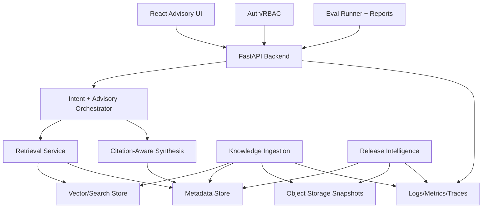
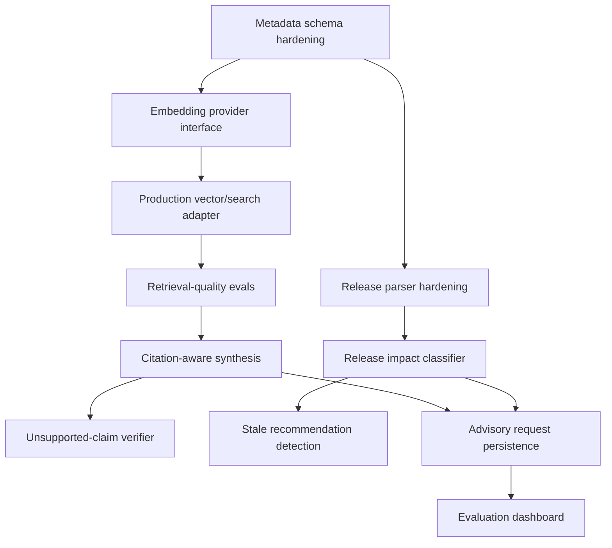

# OCI Architecture Studio — Phase 2 Architecture

Last updated: 2026-05-14

## Executive Summary

Phase 1 proved the core loop:

```text
user question -> intent classification -> local retrieval -> structured advisory response -> eval validation
```

Phase 2 should turn that loop into a scalable, enterprise-grade OCI advisory platform without jumping prematurely to multi-agent orchestration or microservices.

The recommended next milestone is:

```text
Production retrieval + citation-aware LLM synthesis + release-impact guardrails
```

This means replacing deterministic local embeddings with production embeddings, replacing local JSON search with a production vector/search backend, enforcing citation-aware synthesis, and using release snapshots to mark recommendations as current, stale, or needing review.

## Current Architecture Review

### Strengths

- Clean monorepo layout with backend, frontend, knowledge, prompts, evals, docs, and infra boundaries.
- FastAPI backend is modular enough for Phase 2: API, models, services, config, retrieval, orchestration.
- React/Vite frontend is simple and demo-ready.
- Local ingestion pipeline has the right shape: source registry, fetch, cleanup, chunk, embed, write snapshot.
- Retrieval outputs now include citation-friendly metadata.
- Intent-aware orchestration gives deterministic behavior for core demos.
- Golden and edge-case evals provide a strong regression baseline.
- Release-awareness has a separate registry and snapshot path, which prevents release notes from polluting normal architecture knowledge.
- CI already runs backend tests, frontend build, ingestion smoke tests, and evals.

### Bottlenecks

- Local hashing embeddings are deterministic but not semantic enough for production retrieval.
- JSON vector snapshots are fine for local development but not scalable for large corpora, concurrent updates, or metadata filtering.
- Response synthesis is still template/profile based, not a real evidence-grounded advisory answer.
- Release parsing is heuristic-based and not yet robust against real Oracle documentation layouts.
- Eval checks are mostly deterministic keyword/metadata checks; useful, but not enough for nuanced advisory quality.
- Frontend shows source metadata but does not yet support review history, evidence grouping, or confidence display.

### Technical Debt

- Source metadata is inferred from source IDs instead of a complete explicit registry schema.
- Chunk versioning is not modeled yet.
- Release snapshots are not linked to knowledge chunks or recommendations.
- No durable run records for ingestion, eval, or advisory requests.
- No user identity, RBAC, tenancy boundaries, or audit trail.
- No observability model for retrieval misses, weak grounding, or unsupported-claim suppression.

### Scalability Risks

- Retrieval quality will degrade as the corpus grows unless indexing supports semantic search, metadata filters, and reranking.
- Release-aware guidance can become misleading if freshness and source date are not enforced.
- Prompt/template changes can regress behavior unless eval governance becomes stricter.
- Without audit logs, enterprise users cannot review why a recommendation was made.
- Without tenant isolation, enterprise deployment cannot safely support multiple teams/customers.

### Maintainability Risks

- Hardcoded intent profiles can grow unwieldy.
- Heuristic release parsing can become brittle.
- Eval cases can become noisy if not tied to real failures.
- Metadata inference will drift unless source registry ownership and schema validation are added.

## Phase 2 Target Architecture

Keep the platform modular, but still deployable as a single backend application at first.



## Recommended Repository Evolution

Current monorepo structure is good. Evolve it without splitting services yet.

```text
app/
  backend/
    src/oci_arch_studio_backend/
      api/
      core/
      models/
      services/
        retrieval/
        synthesis/
        release/
        evaluation/
        observability/
  frontend/

knowledge/
  ingestion/
  refresh/
  classifiers/
  schemas/
  snapshots/
  source_registry.json
  release_source_registry.json

prompts/
  architecture-review.*.md
  synthesis/
  guardrails/

evals/
  golden-prompts.jsonl
  edge-cases.jsonl
  release-impact.jsonl
  retrieval-quality.jsonl
  reports/

infra/
  local/
  oci/
  github/
```

Do not create independent microservices yet. Instead, create internal service modules with clean interfaces so deployment can split later if needed.

## Production Retrieval Architecture

### Embedding Strategy

Recommended path:

1. Keep local hash embeddings only for offline tests.
2. Add an embedding provider abstraction:
   - `LocalHashingEmbeddingProvider`
   - `OciGenerativeAiEmbeddingProvider`
3. Generate embeddings during ingestion, not during request handling except for the query.
4. Persist embedding model name, dimensions, provider, and created timestamp per chunk.
5. Add embedding-version compatibility checks before search.

OCI-native option:
- OCI Generative AI provides managed models for text embeddings and semantic search use cases.

### Vector/Search Store Strategy

Recommended path:

1. Keep JSON vector store for local development.
2. Add a production store interface:
   - `search(query, filters, top_k)`
   - `upsert_chunks(chunks)`
   - `delete_by_source_version(source_id, version)`
3. Start with OCI Search with OpenSearch for hybrid search and metadata filtering.
4. Consider Oracle Database / AI Vector Search when the product needs relational joins, tenancy/audit data, and vectors in one database.

Use hybrid retrieval:

```text
query -> semantic vector search -> metadata filters -> lexical boost -> rerank -> citation bundle
```

### Metadata Schema

Move from inferred metadata to explicit schema.

```json
{
  "chunk_id": "oci-object-storage-overview::v1::0001",
  "source_id": "oci-object-storage-overview",
  "source_url": "https://docs.oracle.com/...",
  "title": "OCI Object Storage Overview",
  "service": "Object Storage",
  "service_domain": "storage",
  "intent_tags": ["architecture", "cost", "dr"],
  "architecture_patterns": ["static-assets", "backup-storage"],
  "trust_level": "official",
  "source_version": "2026-05-14",
  "content_hash": "sha256:...",
  "chunk_hash": "sha256:...",
  "fetched_timestamp": "2026-05-14T00:00:00Z",
  "valid_from": "2026-05-14",
  "valid_to": null,
  "freshness_score": 0.91,
  "embedding_model": "oci-cohere-embed",
  "embedding_version": "v1",
  "ingestion_run_id": "run-20260514-001"
}
```

## Retrieval & Knowledge Evolution

### Chunk Versioning

Use immutable chunk versions:

```text
source_id + source_version + chunk_index + chunk_hash
```

When a source changes:

- keep old chunks for auditability
- mark old chunks `valid_to`
- index new chunks with a new `source_version`
- route retrieval to latest-valid chunks by default

### Freshness Management

Freshness should combine:

- source type
- fetch age
- release-note relevance
- trust level
- service volatility
- whether a newer release affects the same service/domain

Example:

```text
freshness_score = source_recency * trust_weight * release_impact_weight
```

Do not treat old knowledge as wrong automatically. Mark it:

- `current`
- `needs_release_review`
- `stale`
- `superseded`

### Stale Knowledge Invalidation

Add invalidation rules:

- same service + high-impact release -> mark related chunks `needs_release_review`
- source content hash changed -> reindex source
- source removed/unreachable repeatedly -> mark `source_unavailable`
- service renamed -> mark older chunks `superseded`

### Selective Reindexing

Reindex by:

- source ID
- service
- service domain
- source URL hash change
- release impact tag
- failed eval case

Avoid full corpus reindexing unless embedding model or chunking policy changes.

### Source Trust Scoring

Suggested trust levels:

| Trust Level | Examples | Retrieval Behavior |
|---|---|---|
| official | Oracle docs, OCI release notes | highest priority |
| oracle_reference | Oracle blogs, architecture center | high priority |
| partner | validated partner guidance | medium priority |
| internal | enterprise-specific notes | tenant-scoped priority |
| unverified | imported notes | cite cautiously |

### Architecture Pattern Retrieval

Add pattern tags:

- `public-ingress`
- `private-subnets`
- `three-tier`
- `active-passive-dr`
- `active-active-dr`
- `migration-waves`
- `rightsizing`
- `auditability`
- `regulated-workload`

Retrieval should use:

```text
intent + service + pattern + freshness + trust
```

## Advisory Intelligence Evolution

### Citation-Aware Synthesis

The synthesis layer should accept:

```text
user question
intent
retrieved evidence bundle
release context
response schema
guardrails
```

And return:

```json
{
  "answer": "...",
  "recommendations": [],
  "assumptions": [],
  "risks": [],
  "evidence": [
    {
      "claim": "Use Load Balancer for ingress.",
      "citation_ids": ["oci-load-balancer-overview::v2::0001"],
      "confidence": 0.87
    }
  ],
  "not_enough_evidence": [],
  "unsupported_claims_suppressed": []
}
```

### Evidence-Grounded Recommendations

Every major recommendation should have:

- one or more citations
- source trust level
- freshness status
- confidence score
- assumption boundary

### Citation Enforcement

Synthesis rules:

- no service recommendation without citation
- no release claim without release citation
- no “latest/current” language without release snapshot match
- unsupported service names must be rejected or clarified

### Unsupported-Claim Suppression

Add a post-synthesis verifier:

```text
extract claims -> map claims to citations -> flag unsupported -> suppress or downgrade
```

Response behavior:

- supported: include recommendation
- weakly supported: include as assumption or option
- unsupported: omit or say not enough evidence
- invented service: explicitly reject

### Confidence Scoring

Confidence should not be model self-confidence only.

Use:

- retrieval score
- citation count
- source trust
- freshness
- evidence agreement
- eval history for that intent/domain

Suggested labels:

- `high`: strong official citations, fresh, multiple aligned sources
- `medium`: official citations but limited corpus or assumptions needed
- `low`: weak retrieval, stale sources, or missing requirements
- `not_enough_evidence`: cannot safely answer

### “Not Enough Evidence” Handling

The platform should say this when:

- required OCI service evidence is missing
- release context is requested but no release snapshot match exists
- user constraints conflict
- prompt lacks workload specifics for production design

## Release Intelligence Evolution

Build release awareness in three layers.

### 1. Watcher Layer

Responsibilities:

- fetch OCI release sources
- detect page/content changes
- store raw snapshots
- compute hashes
- emit changed-source events

MVP implementation:

```text
release_source_registry -> fetch -> raw snapshot -> parsed release items
```

### 2. Intelligence Layer

Responsibilities:

- classify release by service/domain
- classify impact:
  - architecture
  - migration
  - cost
  - security
  - dr
  - operations
- detect service renames/deprecations
- detect limits/pricing/security behavior changes
- map releases to affected chunks and eval cases

### 3. Refresh Layer

Responsibilities:

- mark affected chunks `needs_release_review`
- selectively reindex changed docs
- rerun impacted eval cases
- create recommendation refresh tasks
- produce an impact summary

### Release Impact Analysis

Impact analysis should answer:

```text
What changed?
Which service/domain is affected?
Which recommendation types are affected?
Which existing chunks are stale?
Which evals should rerun?
What should users review?
```

### Architecture Drift Detection

Track saved/generated recommendations:

```text
recommendation -> cited chunks -> cited release context -> generated_at
```

When a release affects a cited service:

- mark recommendation `needs_review`
- rerun retrieval and synthesis
- compare old vs new response
- emit drift summary

## Enterprise Readiness

### Auth

Phase 2 should support:

- local/dev auth bypass
- OIDC/SAML-ready enterprise login
- OCI IAM integration path for OCI deployments

### RBAC

Suggested roles:

- `viewer`: ask questions, view own sessions
- `architect`: create/share reviews
- `reviewer`: approve prompt/eval/source changes
- `admin`: manage sources, tenants, policies

### Auditability

Persist:

- user/session ID
- prompt
- intent
- retrieved chunks
- generated answer
- citations
- prompt template version
- model version
- eval status
- release snapshot version

### Observability

Track:

- request latency
- retrieval latency
- ingestion duration
- retrieval miss rate
- weak-grounding rate
- unsupported-claim suppression count
- stale-source hit rate
- eval pass/fail trend

### Evaluation Dashboards

Add dashboard views:

- pass/fail trend
- failures by intent
- retrieval gaps
- unsupported claim categories
- stale knowledge warnings
- release-impact eval results

### Prompt Governance

Treat prompts as versioned assets:

- prompt ID
- version
- owner
- changelog
- approval status
- linked evals
- rollback path

Require eval pass before promoting a prompt.

### Deployment Strategy

Practical Phase 2:

1. keep one backend service
2. deploy frontend separately or through backend/static hosting
3. use OCI-managed storage/search services
4. run ingestion/release jobs as scheduled jobs
5. archive snapshots and reports in object storage

### Multi-Tenant Considerations

Plan tenant isolation early:

- tenant ID on reviews, sources, evals, and snapshots
- tenant-scoped private sources
- shared official OCI corpus
- per-tenant RBAC
- per-tenant audit logs

Do not implement heavy multi-tenancy until auth and persistence are introduced.

## Evaluation Governance

Phase 2 eval suites:

```text
golden-prompts.jsonl
edge-cases.jsonl
retrieval-quality.jsonl
release-impact.jsonl
security-governance.jsonl
tenant-policy.jsonl
```

Promotion gates:

- backend tests pass
- frontend build passes
- ingestion smoke passes
- golden evals pass
- release-impact evals pass for affected services
- no high-severity unsupported-claim findings
- retrieval coverage stays above threshold

## Sprint 2 Roadmap

### Epic 1 — Production Retrieval Foundation

Milestone:
- provider abstraction and production vector/search adapter skeleton

Tasks:
1. Add embedding provider interface.
2. Add OCI embedding provider implementation.
3. Add vector store interface.
4. Add OpenSearch or Oracle vector adapter spike.
5. Add metadata filter support.
6. Add retrieval-quality evals.

### Epic 2 — Citation-Aware Synthesis

Milestone:
- first LLM-generated answer with strict citation grounding

Tasks:
1. Add synthesis service.
2. Add response schema with claim/evidence mapping.
3. Add prompt template for citation-aware answer generation.
4. Add unsupported-claim verifier.
5. Add “not enough evidence” behavior.
6. Add synthesis eval cases.

### Epic 3 — Release Impact Intelligence

Milestone:
- release snapshot can mark affected services/chunks and trigger evals

Tasks:
1. Improve release parser.
2. Add release impact classifier.
3. Map release items to service/domain/source chunks.
4. Add stale recommendation detection.
5. Add release-impact eval suite.

### Epic 4 — Enterprise Governance Baseline

Milestone:
- audit-ready request records and prompt/source governance metadata

Tasks:
1. Add persistence for advisory request records.
2. Add prompt version metadata.
3. Add source registry schema validation.
4. Add eval run records.
5. Add basic observability metrics/logging.

## Dependency Graph



## Recommended Implementation Order

1. Harden metadata schema and source registry validation.
2. Add embedding/vector provider interfaces.
3. Add production retrieval adapter spike.
4. Add retrieval-quality evals.
5. Add citation-aware synthesis.
6. Add unsupported-claim verifier.
7. Improve release parser and impact classifier.
8. Add stale recommendation detection.
9. Add request/eval persistence.
10. Add basic observability dashboard.

## Top Architectural Risks

1. Retrieval quality risk: weak embeddings or missing metadata will produce generic answers.
2. Release accuracy risk: release-awareness can overclaim if release snapshots are incomplete.
3. Governance risk: enterprise users need auditability before trusting recommendations.
4. Prompt drift risk: prompt changes can silently change behavior without eval governance.
5. Corpus coverage risk: gaps in official OCI docs can look like model weakness.
6. Cost/latency risk: production embeddings, reranking, and synthesis can become expensive without caching.

## Recommended Next Milestone

Build:

```text
Phase 2 Milestone 1: Production Retrieval Spike
```

Definition of done:

- embedding provider interface exists
- production OCI embedding provider works in a dev environment
- vector/search adapter interface exists
- one production backend option is tested with metadata filters
- retrieval-quality eval suite exists
- local JSON mode still works
- demo prompts remain green

This gives the platform a stronger retrieval foundation before adding richer synthesis. It is the right next move because every future feature depends on trustworthy evidence retrieval.
