# Controlled Multi-Agent Orchestration Pilot

Last updated: 2026-05-15

## Purpose

The controlled multi-agent pilot introduces bounded specialist collaboration without creating autonomous agent swarms or a distributed orchestration system.

The design keeps the current validated advisory workflow intact:

1. Classify intent.
2. Retrieve shared OCI evidence.
3. Select one or more bounded specialist advisors.
4. Share the same retrieved evidence with every selected specialist.
5. Aggregate specialist contributions into one final synthesis step.
6. Run a validation critic over evidence support, citations, freshness, and unsupported-claim risk.
7. Return the same structured architecture-review response with additional orchestration metadata.

## Current Architecture

```mermaid
flowchart LR
    UI["React UI"] --> API["FastAPI /architecture-review"]
    API --> Classifier["Intent Classifier"]
    Classifier --> Retrieval["Shared Retrieval / Evidence Layer"]
    Retrieval --> Supervisor["Supervisor"]
    Supervisor --> Specialists["Specialist Advisors"]
    Specialists --> Aggregator["Final Synthesizer / Aggregator"]
    Aggregator --> Synth["Configured Synthesis Provider"]
    Synth --> Quality["Citation + Confidence Analyzer"]
    Quality --> Critic["Validation Critic"]
    Critic --> Response["Structured Response"]
```



## Agent Roles

| Agent | Responsibility |
|---|---|
| `supervisor` | Selects bounded specialists, shares the evidence set, and records the routing decision. |
| `architecture_advisor` | Handles architecture, security, product-overview, and general advisory prompts until separate specialists are justified. |
| `migration_advisor` | Focuses on source-to-target mapping, dependencies, waves, cutover, and rollback. |
| `ha_dr_advisor` | Focuses on RTO/RPO, cross-region resilience, failover, security, audit, and runbooks. |
| `cost_advisor` | Focuses on rightsizing, autoscaling, budgets, storage choices, and cost tradeoffs. |
| `release_awareness_advisor` | Focuses on freshness boundaries, release evidence, stale guidance, and current-vs-snapshot caution. |
| `validation_critic` | Reviews the final advisory for evidence support, citation coverage, freshness, unsupported claims, and fallback behavior. |
| `final_synthesizer` | Preserves single-writer final response generation through the configured synthesis provider. |

## Provider Abstraction

The agent layer does not own model execution. It delegates synthesis through the existing provider abstraction:

- `ADVISORY_SYNTHESIS_PROVIDER=deterministic`
- `ADVISORY_SYNTHESIS_PROVIDER=oci_genai`

This keeps model/provider selection config-driven and leaves room for future OpenAI-SDK-compatible adapters or OCI enterprise agent services without forking the application.

## Configuration

```bash
ADVISORY_ORCHESTRATION_MODE=multi_agent_pilot
ADVISORY_SYNTHESIS_PROVIDER=deterministic
```

Rollback is config-only:

```bash
ADVISORY_ORCHESTRATION_MODE=supervised
ADVISORY_ORCHESTRATION_MODE=single_pass
```

`multi_agent_pilot` selects one or more specialists, records contributions, and preserves one final synthesis step.
`supervised` routes to one specialist advisor plus the validation critic.
`single_pass` preserves the original advisory flow and returns no active specialist agents.

## API Additions

`POST /architecture-review` now includes additive orchestration metadata:

- `orchestration_mode`
- `active_agents`
- `routing_decision`
- `agent_trace`
- `agent_contributions`
- `aggregation_decision`
- `critic_findings`
- `orchestration_warnings`

`GET /orchestration/health` returns the latest orchestration mode, active agents, routing decision, aggregation decision, agent count, critic warning count, and request count.

## Governance

The foundation preserves existing governance:

- golden evals still run through the same endpoint
- edge-case evals still run through the same endpoint
- advisory-quality evals still run through the same endpoint
- orchestration-quality evals validate routing, specialist contributions, aggregation, critic presence, grounding, and rollback-safe metadata
- citation enforcement and confidence scoring remain centralized
- retrieval evidence is shared and reused rather than copied into separate agent-specific stores

## Operational Guidance

Use these commands during local validation:

```bash
app/backend/.venv/bin/python evals/run_golden.py --cases evals/orchestration-quality.jsonl --output-dir evals/reports/orchestration-quality
curl http://localhost:8000/orchestration/health
```

Watch for:

- missing `validation_critic`
- missing `final_synthesizer`
- missing `agent_contributions`
- low citation coverage
- repeated critic warnings
- unexpected `single_pass` mode in staging
- synthesis fallback spikes

## Deferred

- No autonomous planning loops.
- No multi-agent memory.
- No distributed agent runtime.
- No LangGraph or similar orchestration framework.
- No provider-specific agent logic.

The next milestone is to strengthen the critic into a more explicit policy gate for unsupported service claims, stale-release assertions, low-confidence production recommendations, and disagreement between specialist contributions.
