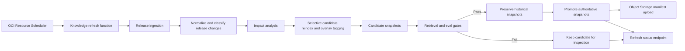

# Continuous Intelligence Operations

Last updated: 2026-05-15

## Purpose

The continuous intelligence pipeline keeps OCI Architecture Studio current without refreshing on user queries and without making unvalidated knowledge authoritative.

The operating rule is simple:

```text
ingest candidate -> validate candidate -> promote only if gates pass -> rollback by manifest if needed
```

## Architecture



## Versioned Artifacts

Each run writes a run-scoped folder under:

```text
knowledge/reports/runs/<run_id>/
```

Tracked artifacts:

- `candidates/oci-rag-index.json`
- `candidates/oci-release-snapshot.json`
- `manifest.json`
- `knowledge-refresh-report.json`
- gate reports under `gates/`
- rollback copies under `rollback/` after promotion

The run manifest records:

- run ID
- policy version
- refresh mode and reason
- affected source IDs
- impacted chunk IDs
- release change categories
- impacted eval cases
- refresh actions
- changed release IDs
- knowledge snapshot version
- release snapshot version
- embedding provider and model
- metadata schema version
- gate outcomes
- rollback source paths
- historical snapshot paths after promotion

## Eval-Gated Promotion

Refreshed knowledge is not authoritative until validation passes.

Candidate gates:

- retrieval health
- retrieval regression for golden and edge cases
- golden evals
- edge-case evals
- advisory-quality evals
- orchestration-quality evals

The quick local gate runs only retrieval health and retrieval regression:

```bash
app/backend/.venv/bin/python knowledge/refresh/refresh_policy.py \
  --mode release-watch \
  --no-fetch \
  --quick-gates
```

Full refresh gate:

```bash
app/backend/.venv/bin/python knowledge/refresh/refresh_policy.py \
  --mode release-watch
```

Weekly stable docs gate:

```bash
app/backend/.venv/bin/python knowledge/refresh/refresh_policy.py \
  --mode stable-docs
```

## Observability

Backend status endpoint:

```text
GET /knowledge/refresh/status
```

The status response includes:

- last run status
- pass/fail state
- changed release count
- release intelligence summary
- impacted services and refresh actions
- affected source IDs
- reindex operations
- gate result summary
- current promoted snapshot lineage
- previous promoted snapshot lineage
- latest rollback event
- recent history

Operational signals to watch:

- failed refresh runs
- repeated gate failures
- stale source detection
- unusually high affected source count
- unexpected release change categories
- unresolved risks in release impact reports
- missing rollback source paths
- retrieval regression failures after refresh
- release-awareness eval failures

## Rollback

Rollback is manifest-driven:

```bash
app/backend/.venv/bin/python knowledge/refresh/refresh_policy.py --rollback-latest
```

Rollback restores the previous authoritative snapshots from the latest promoted run's rollback folder and records a rollback event in:

```text
knowledge/reports/knowledge-refresh-status.json
```

For staging, keep provider rollback config available:

```text
RETRIEVAL_PROVIDER=local_json
```

Use provider rollback if Object Storage retrieval degrades independently of the local authoritative snapshot.

## Governance

Cadence:

- release notes: every 6 hours in staging/prod
- fast-changing service pages: daily
- stable OCI docs: weekly
- full reindex: manual only

Promotion rules:

- critical release updates can trigger immediate operator refresh
- non-critical updates remain on scheduled cadence
- failed gates block promotion
- full reindex requires explicit operator intent
- no refresh runs on user query

Severity guidance:

- `security`, `dr`, `migration`, and `breaking` impacts require regression gates before promotion
- `informational` impacts update the release candidate but only promote after gates if they affect advisory behavior
- stale or unsupported guidance findings require either rollback or a source registry update before promotion

## Troubleshooting

If refresh fails before gates:

- inspect the run folder under `knowledge/reports/runs/<run_id>/`
- check release parsing and source fetch status
- rerun with `--no-fetch` to isolate network/source availability

If gates fail:

- inspect the gate report folder under `knowledge/reports/runs/<run_id>/gates`
- compare candidate and authoritative snapshots
- add or fix source registry entries if evidence coverage is weak
- do not manually copy candidates into `knowledge/snapshots`

If promoted retrieval degrades:

- run `--rollback-latest`
- set `RETRIEVAL_PROVIDER=local_json` if Object Storage manifest retrieval is unhealthy
- rerun retrieval regression before restoring `oci_object_storage`

## Next Milestone

Add OCI Monitoring metrics for refresh latency, gate failures, candidate promotion count, rollback count, and retrieval regression failures so staging can alert before users see stale or degraded advisory responses.

## OCI Resource Scheduler Activation Gate

OCI Resource Scheduler should invoke the knowledge-refresh OCI Function only after the Function image and IAM path are validated.

Activation remains blocked until:

- the Function image is built and pushed to OCIR
- the controlled no-fetch Function invocation passes from the packaged image
- Terraform plan shows only expected Functions/Scheduler/IAM resources
- runtime diagnostics expose configured Function and schedule OCIDs

Rollback is configuration-only: set `enable_knowledge_refresh_scheduler=false`, apply the reviewed Terraform plan, and continue using operator-triggered refresh commands.
