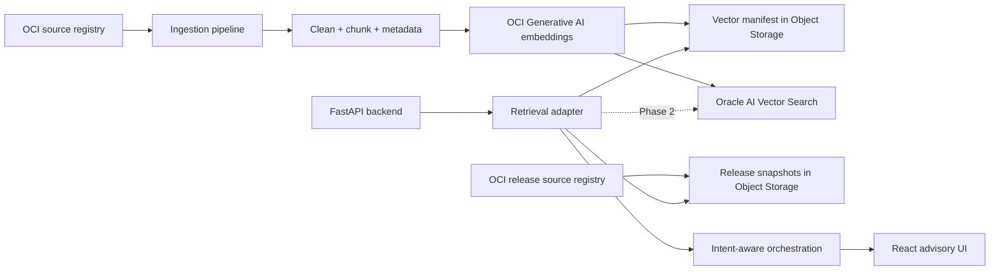

# OCI Architecture Studio — OCI-Native Retrieval Migration

Date: 2026-05-14

## Goal

Move retrieval and knowledge storage from local prototype infrastructure to OCI-native managed services while preserving the validated advisory workflow.

The migration is incremental:

- Keep one codebase.
- Keep local JSON retrieval as the development fallback.
- Introduce OCI-native retrieval through configuration.
- Preserve eval compatibility, citations, chunk metadata, and prompt orchestration.

## Current Retrieval Architecture

Current local path:

1. `knowledge/ingestion/ingest.py` loads `knowledge/source_registry.json`.
2. Documents are fetched or fallback text is used.
3. Text is cleaned and chunked.
4. `LocalHashingEmbedder` creates deterministic local embeddings.
5. Chunks are stored in `knowledge/snapshots/oci-rag-index.json`.
6. `OciKnowledgeRetriever` embeds the query, searches `JsonVectorStore`, applies intent-aware ranking, and returns `RetrievedSource` citations.
7. The orchestrator uses retrieved citations, intent profile, and release snapshot context to produce the API response.

What remains prototype:

- Deterministic local hash embeddings.
- Local JSON vector index.
- Small OCI source corpus.
- Release awareness uses local snapshots rather than live watcher/refresh intelligence.
- Response synthesis is template/profile-driven rather than full LLM synthesis.

What is already production-shaped:

- Stable retrieval interface.
- Citation-ready metadata.
- Intent-aware retrieval.
- Evals and edge-case validation.
- Release snapshot separation.
- Config-first environment model.

## OCI-Native Target Architecture



Target services:

- **OCI Generative AI embeddings** for production semantic embeddings.
- **OCI Object Storage** for migration-safe vector manifests, source snapshots, release snapshots, and rollback assets.
- **Oracle AI Vector Search** for production vector retrieval once schema, credentials, and index lifecycle are finalized.
- **OCI Logging and Monitoring** for retrieval, ingestion, and health diagnostics.
- **OCI Vault** for credentials and provider configuration.

## Implemented Migration Hooks

Backend configuration:

- `EMBEDDING_PROVIDER=local|oci_genai`
- `RETRIEVAL_PROVIDER=local_json|oci_object_storage`
- `OCI_GENAI_COMPARTMENT_ID`
- `OCI_GENAI_EMBEDDING_MODEL_ID`
- `OCI_GENAI_ENDPOINT`
- `OCI_OBJECT_STORAGE_NAMESPACE`
- `OCI_VECTOR_BUCKET`
- `OCI_VECTOR_OBJECT_NAME`
- `OCI_VECTOR_INDEX_NAME`

Backend adapters:

- `LocalHashingEmbedder`
- `OciGenerativeAiEmbedder`
- `JsonVectorStore`
- `OciObjectStorageVectorStore`
- `build_retriever(settings)`

Health and diagnostics:

- `GET /retrieval/health`
- `infra/scripts/check_retrieval_health.py`

Ingestion updates:

- `--embedding-provider local`
- `--embedding-provider oci_genai`
- optional upload of the vector manifest to OCI Object Storage
- manifest metadata fields:
  - `embedding_provider`
  - `embedding_model`
  - `metadata_schema_version`
  - `vector_migration`

## Phased Migration Plan

### Phase 1 — OCI Embeddings And Migration-Safe Manifest

Purpose: generate production embeddings without changing app behavior.

Steps:

1. Keep `RETRIEVAL_PROVIDER=local_json`.
2. Run ingestion with `--embedding-provider oci_genai`.
3. Write the generated manifest locally.
4. Upload the same manifest to Object Storage.
5. Run golden evals and edge-case evals against the local manifest.
6. Compare retrieval results against the previous local hash index.

Example:

```bash
python3 knowledge/ingestion/ingest.py \
  --embedding-provider oci_genai \
  --oci-region "$OCI_REGION" \
  --oci-profile "$OCI_PROFILE" \
  --oci-genai-compartment-id "$OCI_GENAI_COMPARTMENT_ID" \
  --oci-genai-embedding-model-id "$OCI_GENAI_EMBEDDING_MODEL_ID" \
  --oci-namespace "$OCI_OBJECT_STORAGE_NAMESPACE" \
  --oci-upload-bucket "$OCI_VECTOR_BUCKET" \
  --oci-upload-object "$OCI_VECTOR_OBJECT_NAME"
```

### Phase 2 — Read From OCI Object Storage Manifest

Purpose: validate OCI-native retrieval storage while preserving the current vector-store contract.

Configuration:

```bash
RETRIEVAL_PROVIDER=oci_object_storage
EMBEDDING_PROVIDER=oci_genai
OCI_OBJECT_STORAGE_NAMESPACE=...
OCI_VECTOR_BUCKET=...
OCI_VECTOR_OBJECT_NAME=knowledge/oci-rag-index.json
OCI_GENAI_COMPARTMENT_ID=...
OCI_GENAI_EMBEDDING_MODEL_ID=...
```

Validation:

```bash
python3 infra/scripts/check_retrieval_health.py \
  --provider oci_object_storage \
  --embedding-provider oci_genai \
  --oci-region "$OCI_REGION" \
  --oci-profile "$OCI_PROFILE" \
  --oci-namespace "$OCI_OBJECT_STORAGE_NAMESPACE" \
  --oci-vector-bucket "$OCI_VECTOR_BUCKET" \
  --oci-vector-object-name "$OCI_VECTOR_OBJECT_NAME" \
  --oci-genai-compartment-id "$OCI_GENAI_COMPARTMENT_ID" \
  --oci-genai-embedding-model-id "$OCI_GENAI_EMBEDDING_MODEL_ID"
```

### Phase 3 — Oracle AI Vector Search Adapter

Purpose: replace manifest search with production vector retrieval.

Implementation work:

- Define vector table/index schema.
- Preserve chunk ID, source URL, title, service, service domain, intent tags, trust level, freshness score, release version, and fetched timestamp.
- Add metadata filters for service domain, intent, freshness, trust, and architecture pattern.
- Add side-by-side retrieval diff reports.
- Switch default only after evals pass in both local and OCI-native modes.

## Retrieval Intelligence Roadmap

Already added:

- intent-aware ranking
- trust-level ranking boost
- freshness ranking boost
- service-domain filters in the vector store
- release-aware filter hook

Next:

- service-specific filtering from classifier output
- architecture-pattern boosting
- stale-source penalty
- release snapshot recency boost
- unsupported-claim suppression based on retrieved evidence
- retrieval diff report for the demo prompt set

## Observability Plan

Current diagnostics:

- retrieval request count
- missing-index count
- average latency
- last latency
- last result count
- provider name
- embedding model
- last intent
- retrieval warnings

Expose diagnostics with:

```bash
curl http://localhost:8000/retrieval/health
```

Next production metrics:

- embedding generation latency
- embedding error count
- ingestion source fetch count and error count
- chunks generated per source
- vector index object age
- retrieval no-result rate
- citation coverage per answer
- stale-source rate
- eval pass/fail trend by intent

## Validation Strategy

Required before switching retrieval defaults:

```bash
python3 knowledge/ingestion/ingest.py --no-fetch
python3 knowledge/refresh/ingest_releases.py --no-fetch
cd app/backend && PYTHONPATH=src .venv/bin/pytest -q
cd ../..
app/backend/.venv/bin/python evals/run_golden.py --output-dir evals/reports/golden
app/backend/.venv/bin/python evals/run_golden.py --cases evals/edge-cases.jsonl --output-dir evals/reports/edge-cases
python3 infra/scripts/check_retrieval_health.py --provider local_json
cd app/frontend && npm run build
```

OCI-native validation:

- Run Object Storage health check.
- Run the five architecture scenario spot checks.
- Compare citations and top chunks against the local baseline.
- Fail the migration if required services disappear from golden eval responses.
- Fail the migration if citation URLs or chunk IDs are missing.

## Rollback Strategy

Rollback is configuration-only for Phase 1 and Phase 2:

```bash
EMBEDDING_PROVIDER=local
RETRIEVAL_PROVIDER=local_json
KNOWLEDGE_INDEX_PATH=knowledge/snapshots/oci-rag-index.json
```

Then regenerate and validate:

```bash
python3 knowledge/ingestion/ingest.py --no-fetch
python3 knowledge/refresh/ingest_releases.py --no-fetch
cd app/backend && PYTHONPATH=src .venv/bin/pytest -q
```

Do not delete OCI vector assets until the failed retrieval behavior is understood. Keep Object Storage manifests for diffing.

## Operational Troubleshooting

Common issues:

- `retrieval index is missing or unreachable`: check `KNOWLEDGE_INDEX_PATH` or Object Storage bucket/object config.
- `OCI SDK is required`: install backend requirements.
- `OCI_GENAI_COMPARTMENT_ID ... required`: configure OCI embedding settings before using `EMBEDDING_PROVIDER=oci_genai`.
- `OCI_OBJECT_STORAGE_NAMESPACE ... required`: configure Object Storage settings before using `RETRIEVAL_PROVIDER=oci_object_storage`.
- low or generic retrieval: inspect `/retrieval/health`, rerun ingestion, and compare top chunks against the golden prompt expectations.
- stale release behavior: rerun `knowledge/refresh/ingest_releases.py` and review release snapshot age.

## Next Operational Milestone

Build the retrieval comparison report:

- run local JSON retrieval for the five demo prompts
- run OCI Object Storage manifest retrieval for the same prompts
- compare top chunks, required services, citation presence, freshness, and eval scores
- approve Oracle AI Vector Search implementation only after parity is visible
