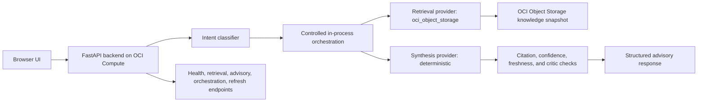

# OCI Architecture Studio — Post-Stabilization Architecture Review

Date: 2026-05-15

## Executive Summary

The repository and staging deployment have been synchronized after the stabilization pass. Staging is now the authoritative live environment for the current baseline, with the same codebase deployed and environment-specific behavior controlled by configuration.

This review distinguishes live staging behavior from implemented-but-gated capabilities.

## Active Staging Architecture

## Active Providers

| Area | Active in staging | Rollback / gated path |
|---|---|---|
| Retrieval | `oci_object_storage` | `local_json` config-only rollback |
| Embeddings | `local-hashing-v1-256` | OCI GenAI embeddings adapter exists, not active |
| Synthesis | `deterministic` | OCI GenAI chat adapter exists, config-gated |
| Orchestration | `multi_agent_pilot` | `supervised` or `single_pass` config rollback |
| Vector search | Object Storage vector manifest | Oracle AI Vector Search scaffolded, not active |
| Refresh | Candidate-first refresh status visible | OCI scheduler/function scaffold requires published function image before full cloud automation |

## Deployment Synchronization Result

- Staging was redeployed from the latest audited working tree.
- Staging now exposes `/knowledge/refresh/status` and `/orchestration/health`.
- `/retrieval/health` reports `oci_object_storage` with 21 chunks, 21 services, and 11 service domains.
- `/advisory/quality` reports deterministic synthesis and multi-agent pilot metadata after live requests.
- Object Storage contains the refreshed `oci-rag-index.json` and `oci-release-snapshot.json`.

## GenAI Activation Readiness

Implemented:

- Config-selected synthesis provider.
- OCI GenAI chat adapter.
- Deterministic fail-closed fallback.
- Synthesis provider, model, latency, warning, and fallback fields.
- GenAI parity checker for deterministic-vs-OCI GenAI comparison.
- CI/deployment readiness hook with `--allow-skip`.

Not active yet:

- Staging synthesis still uses `deterministic`.
- Live OCI GenAI parity requires `OCI_GENAI_COMPARTMENT_ID` and `OCI_GENAI_CHAT_MODEL_ID`.
- OCI GenAI should not become the staging default until parity passes without fallback.

## Knowledge Corpus Expansion

The source registry now includes 21 sources across architecture, compute, containers, cost, database, edge, networking, observability, resilience, security, and storage domains.

Newly added coverage includes IAM, Network Security Groups, Autonomous Database, Vault, Logging, Monitoring, Cloud Guard, and WAF.

Still deferred:

- Budgets-specific guidance.
- Audit-specific guidance.
- Data Guard-specific guidance.
- Deeper workload architecture patterns.

## Validation Summary

Latest stabilization validation passed:

- Backend tests: 50 passed.
- Frontend build: passed.
- Knowledge ingestion: 21 chunks.
- Golden evals: 6 of 6.
- Edge-case evals: 8 of 8.
- Advisory-quality evals: 5 of 5.
- Orchestration-quality evals: 5 of 5.
- Local retrieval regression: 14 of 14.
- Object Storage retrieval regression: 14 of 14.
- Object Storage golden evals: 6 of 6.
- Object Storage edge evals: 8 of 8.
- Staging smoke: backend, frontend, and OCI SDK passed.
- Staging baseline guardrail: passed with `oci_object_storage` and 21 chunks.
- GenAI parity readiness: skipped safely because required OCI GenAI env vars are not set.

## Rollback Notes

Config-only rollback to `local_json` was validated without code or prompt changes.

Operational note: when replacing `/etc/oci-architecture-studio.env`, preserve file ownership, mode, and SELinux context. Prefer `sudo install -o root -g root -m 0644 <file> /etc/oci-architecture-studio.env` followed by `sudo restorecon /etc/oci-architecture-studio.env`.

## Top Remaining Risks

- Public HTTP backend on port 8000 should be replaced with HTTPS ingress.
- OCI GenAI live parity is not complete until model configuration is provided.
- Oracle AI Vector Search remains scaffolded, not an active read path.
- Refresh scheduler/function cloud activation needs a published function image and apply validation.
- Corpus is broader, but still not comprehensive enough for production OCI advisory coverage.

## Recommended Next Milestone

Do the OCI GenAI controlled activation gate:

1. Provide staging GenAI compartment and chat model config.
2. Run deterministic-vs-OCI GenAI parity on golden, edge, advisory-quality, and orchestration scenarios.
3. Measure latency, fallback rate, citation coverage, unsupported claims, and confidence changes.
4. Promote `ADVISORY_SYNTHESIS_PROVIDER=oci_genai` only if parity passes.
5. Keep deterministic synthesis as instant config rollback.
